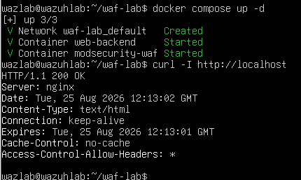
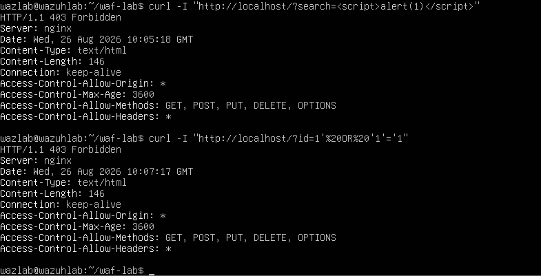
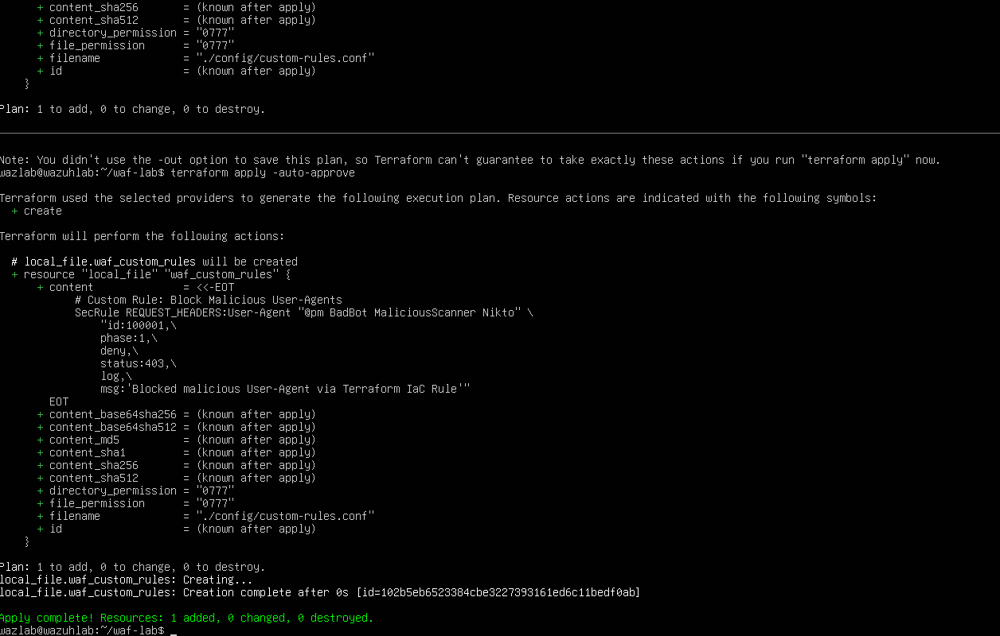
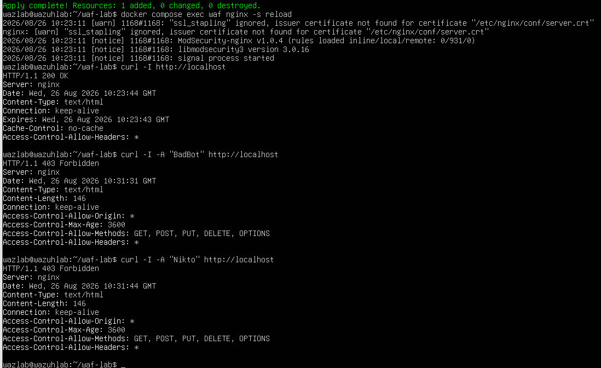
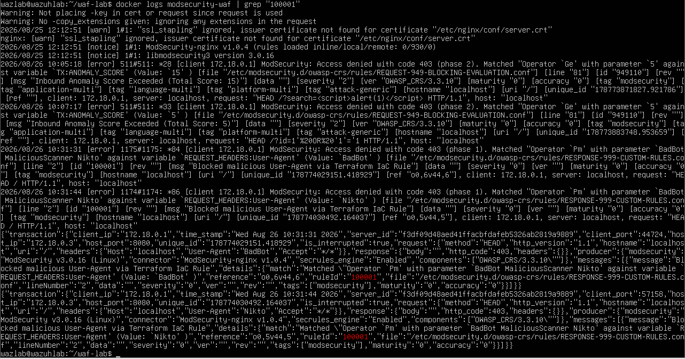

# WAF Operations & IaC Rule Management

## Overview
This lab demonstrates the deployment, configuration, and IaC management of a Web Application Firewall (WAF) using **Docker**, **ModSecurity v3**, **OWASP Core Rule Set (CRS)**, and **Terraform**.

## Architecture & Setup
* **WAF Proxy**: ModSecurity v3 on Nginx (`owasp/modsecurity-crs:nginx`)
* **Backend Application**: Lightweight Nginx web server (`nginxdemos/hello`)
* **Infrastructure as Code**: Terraform (`hashicorp/local` provider) for dynamic rule generation.

## Rule Enforcement & Verification

### 1. Default OWASP CRS Protection
Tested default rule blocks against common application attacks:
* **XSS Attack**: `curl -I "http://localhost/?search=<script>alert(1)</script>"` -> `403 Forbidden`
* **SQLi Attack**: `curl -I "http://localhost/?id=1'%20OR%20'1'='1"` -> `403 Forbidden`




### 2. Custom IaC Rule Management via Terraform
Managed rule ID `100001` via `main.tf` to block malicious User-Agents dynamically (`BadBot`, `Nikto`).

```hcl
SecRule REQUEST_HEADERS:User-Agent "@pm BadBot MaliciousScanner Nikto" \
    "id:100001,phase:1,deny,status:403,log,msg:'Blocked malicious User-Agent via Terraform IaC Rule'"
```



### 3. Test Results
* **Legitimate Request:** HTTP/1.1 200 OK
* **Blocked Request** (User-Agent: BadBot): HTTP/1.1 403 Forbidden
* **Blocked Request** (User-Agent: Nikto): HTTP/1.1 403 Forbidden




